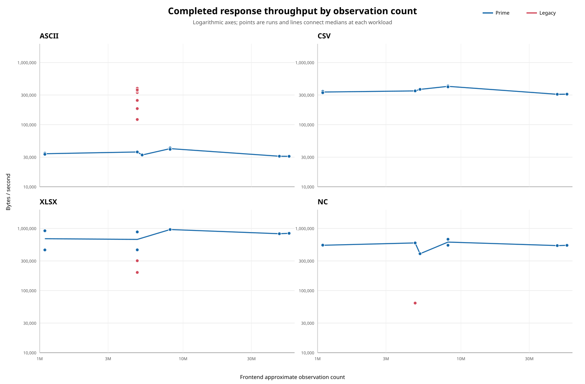
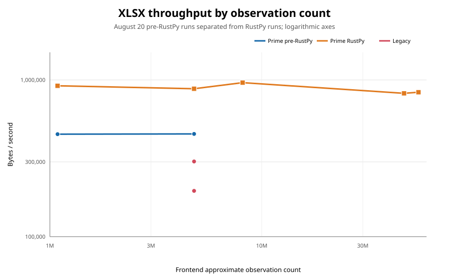

# End-to-end deployed API performance comparison

Date: 2026-08-14

This experiment compared the deployed replacement API and legacy PDP API through
their public routes on `beehive.pacificclimate.org`:

- Replacement ("Prime"): `/prime/api/data/pcds/agg/`
- Legacy: `/met-data-portal-pcds/api/data/pcds/agg/`

Four spatial/query sizes were tested in each of the `ascii`, `csv`, `xlsx`, and
`nc` formats. Each response was downloaded completely and discarded after its
timing and size were recorded.

## Timeout and measurement method

Exact wall-clock start and finish timestamps were not captured. The available
records establish the measurement date and run order: the initial matrix ran on
2026-08-14, the reduced and initial EC_raw/BCH matrices on 2026-08-20, and the
EC_raw/BCH RustPy XLSX rerun on 2026-08-21.

Requests had no overall time limit. A request was classified as stalled when
curl measured a transfer rate below 1 byte per second for 10 seconds:

```text
--connect-timeout 10 --speed-limit 1 --speed-time 10
```

The test recorded curl exit status, HTTP status, elapsed time, time to first
byte, downloaded bytes, and content type. All responses returned HTTP 200 and
`application/zip`, including incomplete legacy streams. Consequently, HTTP
status alone cannot distinguish a valid completed archive from a legacy stream
that failed after sending its headers.

The matrix contains one sequential sample per cell. Prime was requested before
Legacy in each pair, so the results are diagnostic measurements rather than a
statistically controlled benchmark.

## Results

| Request | Format | Prime | Legacy |
|---|---|---|---|
| Big | ascii | Success - **59m 58.5s**, 111.24 MB, TTFB 7.77s | Stalled - 58.6s, 13.98 MB |
| Big | csv | Success - **5m 40.6s**, 105.42 MB, TTFB 7.66s | Stalled - 1m 55.1s, 22.95 MB |
| Big | xlsx | Success - **6m 7.5s**, 306.85 MB, TTFB 6.97s | Stalled - 3m 10.3s, 45.45 MB |
| Big | nc | Success - **4m 42.8s**, 151.16 MB, TTFB 7.01s | Stalled - 2m 28.3s, 14.96 MB |
| Big, filtered | ascii | Success - **52m 31.6s**, 97.81 MB, TTFB 6.77s | Stalled - 26.0s, 2.07 MB |
| Big, filtered | csv | Success - **5m 0.2s**, 92.45 MB, TTFB 6.93s | Stalled - 42.0s, 11.57 MB |
| Big, filtered | xlsx | Success - **5m 24.9s**, 266.86 MB, TTFB 6.85s | Stalled - 40.9s, 6.35 MB |
| Big, filtered | nc | Success - **4m 12.0s**, 133.41 MB, TTFB 7.09s | Stalled - 37.8s, 2.13 MB |
| Smaller | ascii | Success - **8m 19.1s**, 21.02 MB, TTFB 1.80s | Stalled - 52.3s, 6.35 MB |
| Smaller | csv | Success - **48.4s**, 20.37 MB, TTFB 1.78s | Stalled - 37.5s, 7.12 MB |
| Smaller | xlsx | Success - **51.8s**, 49.74 MB, TTFB 1.92s | Stalled - 1m 11.2s, 18.18 MB |
| Smaller | nc | Success - **39.6s**, 26.54 MB, TTFB 1.76s | Stalled - 1m 25.4s, 7.11 MB |
| Small | ascii | Success - **56.5s**, 1.96 MB, TTFB 0.12s | Stalled - 18.0s, 5.8 KB |
| Small | csv | Success - **5.38s**, 1.85 MB, TTFB 0.13s | Stalled - 16.0s, 5.8 KB |
| Small | xlsx | Success - **5.97s**, 5.48 MB, TTFB 0.11s | **Transport completed - 31.4s**, 5.77 MB |
| Small | nc | Success - **4.39s**, 2.35 MB, TTFB 0.12s | Stalled - 17.0s, 7.1 KB |

"Transport completed" means curl observed a normally closed response. The
downloaded archive was discarded, so its contents were not independently
validated.

## Findings

- Prime completed every request. Legacy completed the transport only for the
  Small XLSX request.
- Prime's Big NetCDF result of 4m 42.8s closely matched the approximately
  five-minute manual observation.
- ASCII generation is the major Prime outlier. It was consistently about ten
  times slower than CSV despite producing similarly sized archives:
  - Big: 59m 58s versus 5m 41s
  - Big, filtered: 52m 32s versus 5m
  - Smaller: 8m 19s versus 48s
  - Small: 56.5s versus 5.4s
- Network transfer is not the primary explanation for the ASCII result. Prime
  generated and transferred a 306.85 MB XLSX archive in 6m 7s, but required
  nearly an hour for a 111.24 MB ASCII archive. This points strongly toward
  application-side ASCII generation or serialization.
- On the only request where both transports completed, Prime XLSX was about
  5.3 times faster than Legacy: 5.97s versus 31.4s.
- Filtering the Big request reduced Prime response size and completion time by
  approximately 11-13%.
- Legacy often sends HTTP 200 headers and begins streaming quickly, then stops
  mid-ZIP. A client or benchmark must validate transfer completion and ideally
  the resulting archive, rather than relying on HTTP status.

## Recommended next experiment

The next comparison should be deliberately bounded so it finishes promptly and
measures like-for-like successful work.

1. Select stations and query parameters that are known to complete successfully
   on Legacy in all four formats. This removes legacy data/variable errors from
   the performance comparison.
2. Use cases whose slowest format completes on each deployment in less than ten
   minutes. Exclude or reduce any case that crosses that limit; do not include
   the current Big ASCII cases.
3. Run the matching Prime and Legacy request for each test case concurrently.
   Pairing the endpoint requests reduces total wall-clock time and exposes both
   deployments to approximately the same transient network and database-cache
   conditions.
4. Keep different test cases and formats sequential. Running the entire matrix
   concurrently would introduce database, CPU, compression, and network
   contention that makes individual timings harder to interpret.
5. Alternate which endpoint process is started first within successive repeats,
   or release each pair from the same synchronization barrier, to avoid a
   systematic start-order advantage.
6. Repeat every cell at least three times. Report the median, minimum, maximum,
   and individual samples rather than relying on a single measurement.
7. Retain the stalled-transfer timeout for broken streams, but also use a
   ten-minute overall guardrail for the deliberately bounded test set.
8. Save each response long enough to verify that it is a readable ZIP and that
   its entries can be opened. Record final archive size and, if practical, the
   entry count. Delete the artifacts after validation.
9. Record HTTP status, curl exit status, total time, TTFB, bytes downloaded,
   content type, archive-validation result, and any failure reason.
10. Compare only cells where both systems returned valid, complete archives.
    Record failures separately rather than treating the time until failure as a
    performance result.

With paired endpoint requests but sequential formats and test cases, a matrix of
four cases, four formats, and three repetitions requires 48 paired runs rather
than 96 sequential endpoint runs. Keeping every pair below ten minutes bounds
the worst-case duration while preserving a useful range of response sizes.

## Reduced paired run: 2026-08-20

A second run omitted both Big cases and tested:

- Smaller, using the original network filter
- Smaller limited to `network-name=EC_raw%2CMoTIe`
- Small

For each case and format, Prime and Legacy were started concurrently. Different
cases and formats remained sequential. Completed downloads were retained long
enough to run `unzip -tqq`; only archives that passed that check are marked
valid.

The requests used both a ten-minute overall guardrail and the original
1-byte-per-second-for-10-seconds stall rule.

The Prime XLSX measurements in this 2026-08-20 run used the pre-RustPy engine.
The other formats are unaffected by the XLSX engine selection.

| Request | Format | Prime | Legacy |
|---|---|---|---|
| Smaller | ascii | Valid - **8m 44.2s**, 21.03 MB, TTFB 2.38s | Stalled - 32.1s, 0.94 MB |
| Smaller | csv | Valid - **50.2s**, 20.37 MB, TTFB 1.93s | Stalled - 17.0s, 3 KB |
| Smaller | xlsx | Pre-RustPy, cut off - **1m 19.7s**, 32.45 MB, TTFB 2.28s | Stalled - 17.0s, 3 KB |
| Smaller | nc | Valid - **49.6s**, 26.56 MB, TTFB 6.32s | Stalled - 1m 33.7s, 7.11 MB |
| Smaller, EC_raw/MoTIe | ascii | Valid - **5m 28.4s**, 10.67 MB, TTFB 0.21s | Stalled - 17.0s, 1.1 KB |
| Smaller, EC_raw/MoTIe | csv | Valid - **26.4s**, 9.77 MB, TTFB 0.21s | Stalled - 17.0s, 1.1 KB |
| Smaller, EC_raw/MoTIe | xlsx | Pre-RustPy, cut off - **31.6s**, 7.07 MB, TTFB 0.19s | Stalled - 17.0s, 1.1 KB |
| Smaller, EC_raw/MoTIe | nc | Valid - **27.0s**, 10.56 MB, TTFB 0.52s | Stalled - 17.0s, 1.1 KB |
| Small | ascii | Valid - **58.8s**, 1.96 MB, TTFB 0.16s | Stalled - 19.0s, 5.8 KB |
| Small | csv | Valid - **5.67s**, 1.85 MB, TTFB 0.35s | No response - 11.0s, HTTP 000, 0 bytes |
| Small | xlsx | Pre-RustPy, valid - **12.69s**, 5.72 MB, TTFB 0.53s | No response - 11.0s, HTTP 000, 0 bytes |
| Small | nc | Valid - **4.37s**, 2.35 MB, TTFB 0.17s | No response - 11.0s, HTTP 000, 0 bytes |

### Conclusions from the reduced run

- The EC_raw/MoTIe filter substantially reduced Prime response size and time,
  but it did not produce a Legacy-compatible data set. Every Legacy format
  stopped after sending only about 1.1 KB.
- The Prime ASCII anomaly repeated. For Smaller it took 8m 44s versus about 50s
  for CSV and NetCDF. With EC_raw/MoTIe it took 5m 28s versus about 27s.
- The ten-second low-speed threshold is too aggressive for Prime XLSX. Both
  larger Prime XLSX responses paused for long enough to be cut off even though
  earlier runs demonstrated that the same kind of response can complete and
  validate successfully.
- Pairing Prime and Legacy requests reduces elapsed test time, but aborting a
  client-side Legacy stream may not cancel its server-side work. Repeated
  aborted streams can plausibly occupy all Legacy Gunicorn workers. The later
  HTTP 000 results are consistent with worker exhaustion, although server-side
  process and request logs would be needed to confirm it.
- Only completed, ZIP-validated responses should be used for timing
  comparisons. None of the Legacy responses in this run qualified.

### Revised protocol for the next run

1. Identify candidate Legacy-safe stations with isolated preflight requests
   before starting the performance matrix. Require every format to complete and
   pass ZIP validation.
2. Do not proceed with a candidate after any Legacy format stalls or produces
   an invalid archive. Allow the Legacy deployment to finish or recover before
   trying another candidate so abandoned work does not accumulate across its
   workers.
3. Use the ten-minute overall guardrail for the bounded matrix, but increase
   the low-speed window to at least 60 seconds or omit it for Prime. A
   ten-second generation pause is valid behavior for XLSX.
4. Once a data set is confirmed safe on both systems, start its matching Prime
   and Legacy requests concurrently. Continue to run formats and cases
   sequentially.
5. Save and validate every completed ZIP. Treat a transport completion with an
   invalid ZIP as a failure, regardless of HTTP status.
6. Keep ASCII cases small enough that Prime finishes comfortably under ten
   minutes. The original Smaller case is close to the limit and should be the
   maximum size, not the median case.
7. Run at least three paired repetitions only after the preflight stage has
   proven that both applications can complete every selected cell.

## EC_raw/BCH candidate: 2026-08-20

The Smaller polygon was tested with
`network-name=EC_raw%2CBCH`. Legacy was preflighted sequentially before the
paired comparison. The preflight used a ten-minute overall limit and initially
used a 60-second low-speed window.

### Legacy preflight

| Format | Result | Time | Size | TTFB |
|---|---|---:|---:|---:|
| ascii | Valid ZIP | 1m 31.4s | 14.79 MB | 1.27s |
| csv | Valid ZIP | 43.5s | 14.79 MB | 0.12s |
| xlsx | Valid ZIP | 2m 15.0s | 41.37 MB | 0.13s |
| nc | Cut off by 60-second low-speed rule | 2m 20.5s | 7.36 MB | 0.12s |
| nc, retry without low-speed rule | Valid ZIP | 4m 20.3s | 16.43 MB | 0.14s |

The NetCDF retry confirms that even a 60-second low-speed rule can interrupt a
valid Legacy response. For subsequent paired requests, only the ten-minute
overall guardrail was used.

### Paired comparison

The Prime XLSX measurement in this initial 2026-08-20 EC_raw/BCH comparison
used the pre-RustPy engine.

| Format | Prime | Legacy | Comparison |
|---|---|---|---|
| ascii | Valid - **4m 50.2s**, 10.55 MB, TTFB 0.41s | Valid - **44.7s**, 14.79 MB, TTFB 0.14s | Legacy 6.5x faster |
| csv | Valid - **29.2s**, 10.20 MB, TTFB 0.32s | Ten-minute timeout - 6.73 MB, TTFB 0.13s | No valid comparison |
| xlsx | Pre-RustPy, valid - **1m 5.3s**, 29.52 MB, TTFB 0.54s | Valid - **2m 17.1s**, 41.37 MB, TTFB 0.35s | Prime 2.1x faster |
| nc | Valid - **23.3s**, 13.62 MB, TTFB 0.32s | Valid - **4m 20.9s**, 16.43 MB, TTFB 0.14s | Prime 11.2x faster |

This candidate is capable of completing on Legacy in every format, but its CSV
completion was not repeatable: it completed and validated in 43.5 seconds in
the isolated preflight, then failed to complete within ten minutes in the
paired run. The databases are separate, so this cannot be attributed to the two
requests contending for the same database. Possible shared factors include the
deployment host, proxy/network path, and application behavior, but the run did
not collect the server-side evidence needed to distinguish them.

### Legacy ASCII repeat check: 2026-08-21

The exact Legacy EC_raw/BCH ASCII request was repeated five times to check the
suspicious 44.75-second paired result. Every repeat returned HTTP 200, produced
a valid ZIP, and downloaded 14,786,192 bytes.

| Repeat | Start (America/Vancouver) | Time | TTFB | Throughput |
|---:|---|---:|---:|---:|
| 1 | 2026-08-21 16:18:20 | 61.26s | 0.459s | 241,374 B/s |
| 2 | 2026-08-21 16:19:22 | 60.11s | 0.138s | 245,991 B/s |
| 3 | 2026-08-21 16:20:23 | 44.95s | 0.165s | 328,913 B/s |
| 4 | 2026-08-21 16:21:09 | 122.73s | 0.124s | 120,473 B/s |
| 5 | 2026-08-21 16:23:13 | 42.33s | 0.756s | 349,274 B/s |

The median repeat was 60.11 seconds and 245,991 B/s. Repeats 3 and 5 reproduced
the original 44.75-second result closely, so that result is retained. The
samples instead demonstrate high runtime variance: 42.33 to 122.73 seconds for
valid responses of identical size. The throughput plot includes all five
repeats at the same observation count so that this spread remains visible.

### Production Legacy ASCII comparison: 2026-08-22

The same EC_raw/BCH ASCII request was run five times sequentially against the
production Legacy endpoint at `services.pacificclimate.org`. Every request
returned HTTP 200, produced a valid ZIP, and downloaded 14,786,749 bytes.

| Run | Start (America/Vancouver) | Time | TTFB | Throughput |
|---:|---|---:|---:|---:|
| 1 | 2026-08-22 11:29:50 | 122.22s | 3.397s | 120,987 B/s |
| 2 | 2026-08-22 11:31:53 | 81.59s | 1.012s | 181,238 B/s |
| 3 | 2026-08-22 11:33:15 | 38.10s | 0.124s | 388,137 B/s |
| 4 | 2026-08-22 11:34:06 | 38.44s | 0.130s | 384,677 B/s |
| 5 | 2026-08-22 11:34:46 | 40.79s | 0.123s | 362,521 B/s |

The median across all five production runs was 40.79 seconds. More
significantly, the sequence fell from 122.22 to 81.59 seconds and then settled
into a reproducible 38.10--40.79-second range. This is strong end-to-end
evidence of cache warming, although the test does not identify whether the
effective cache is in PostgreSQL, the operating system, or another layer. The
production warm-state results also confirm that Legacy's unexpectedly high
ASCII throughput is real rather than an isolated Beehive measurement.

For the three successful paired formats, Prime was much faster for XLSX and
NetCDF, while Legacy was much faster for ASCII. The ASCII result reinforces that
Prime's ASCII implementation is the principal format-specific performance
problem.

## RustPy XLSX rerun: 2026-08-21

The EC_raw/BCH Smaller XLSX pair was rerun after Prime was redeployed with the
RustPy XLSX engine. Both ZIP archives completed and passed validation.

| Endpoint | Time | Size | TTFB | Throughput |
|---|---:|---:|---:|---:|
| Prime with RustPy | **31.79s** | 27.93 MB | 0.58s | **878,437 B/s** |
| Legacy | **3m 31.20s** | 41.37 MB | 0.78s | **195,891 B/s** |

Prime's previous, pre-RustPy EC_raw/BCH XLSX measurement was 65.29 seconds and
452,227 B/s. With RustPy, elapsed time fell by approximately 51% and throughput
increased by approximately 94%. In the new paired run, Prime delivered bytes
about 4.5 times as quickly as Legacy.

The Legacy side varied substantially between the two paired XLSX runs: 2m 17.1s
previously versus 3m 31.2s in the RustPy rerun. The Prime engine improvement is
clear, but repeated runs are still required to characterize normal variance.

## Throughput plots

The workload counts were queried from `pg01` on 2026-08-21. Station membership
was produced by passing each request through `aggregate.parse_selection` and
`PycdsStationRepository.aggregate_stations`, including its polygon filter.
Observation counts reproduce the frontend method: sum
`obs_count_per_month_history_mv.count` across the selected stations, applying
date bounds at month resolution.

| Scenario | Stations | Frontend approximate observations |
|---|---:|---:|
| Big | 596 | 54,964,866 |
| Big filtered | 577 | 46,993,384 |
| Smaller | 125 | 8,122,597 |
| Smaller EC_raw/MoTIe | 6 | 5,185,405 |
| Smaller EC_raw/BCH | 17 | 4,792,860 |
| Small | 4 | 1,086,886 |

Throughput is calculated as downloaded response bytes divided by total request
time. Stalled, timed-out, truncated, and invalid responses are excluded because
their partial byte counts are not comparable to completed archives. The initial
Prime results are included as completed but unvalidated transports; later
results marked valid passed `unzip -tqq`. Both chart axes are logarithmic;
individual points represent runs, while lines connect the median throughput at
each distinct observation count.



The XLSX-only view separates the Prime pre-RustPy measurements from the Prime
RustPy measurements. Per the deployment clarification, only the Prime XLSX runs
from 2026-08-20 are labeled pre-RustPy; the initial 2026-08-14 XLSX results and
the 2026-08-21 rerun are labeled RustPy. RustPy is orange, pre-RustPy is blue,
and repeated measurements at the same observation count remain visible as
separate points.



The following plot focuses on the Legacy-safe EC_raw/BCH subset. It uses the
latest RustPy rerun for XLSX. Legacy CSV is absent because its paired request did
not complete within ten minutes.


The plotted source data is in
[`END_TO_END_PERFORMANCE_THROUGHPUT.csv`](END_TO_END_PERFORMANCE_THROUGHPUT.csv),
and the SVGs can be regenerated without third-party plotting dependencies:

```shell
poetry run python performance/generate_performance_plots.py
```
